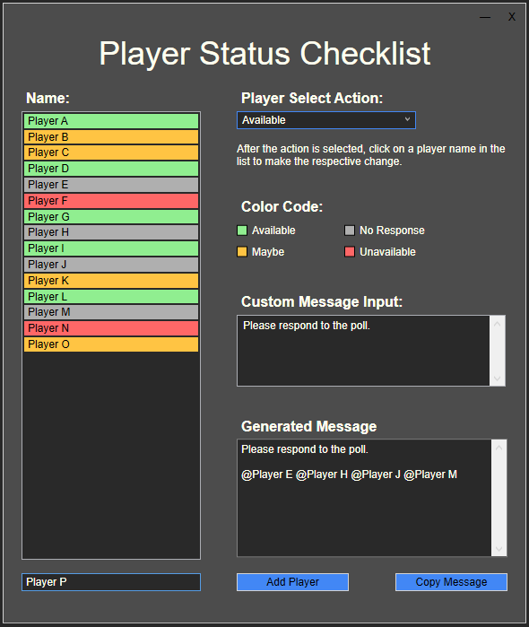

# PlayerStatusChecklist
A desktop application designed help sport coaches with player availability management.

### Background Information
As a coach for a soccer team, I send out polls in our "WhatsApp" group chat to determine who is available for soccer games. Most of the time, there are at least a few players that don't repspond to the poll. I have found that mentioning/tagging these players in the group chat helps to ensure everyone has responded ("@PlayerA @PlayerB Please respond to the poll."). The purpose of this app is to make this task quick and easy.

### General Notes:
- When downloading the executable file, you may receive warnings in the browser. You may also see warnings when attempting to run the executable file. This application is not intended to be harmful in any way. The reason computers might see this executable as a threat is because the executable file is not signed and doesn't have a certificate. Obtaining this certificate is fairly expensive, so I chose not to have the executable file signed.
- This app was created using .NET 8.0 and WPF.

### How to Use:
- Download the zipped folder containing the executable file from the release section on GitHub (you may get warnings).
- Extract the zip folder. The executable file should be contained within a folder. This will keep things organized when the player list text file is generated.
- Enter player names into the text box in the bottom left corner and then click the button that says "Add Player".
- Once all the players are added, click on the drop-down menu and select an action. Actions include: "Available", "Maybe", "Unavailable", "No Response", and "Remove Player".
- After the action is selected, click on the player name in the list box to make changes.
- Adjust the custom message if necessary.
- Click the "Copy Message" button to copy the text found in the "Generated Message" section to the clipboard.
- Open WhatsApp and paste the generated message into the group chat. Note that tagged names will not have blue text after pasting. Modifying the message may be necessary to make sure the tags are working correctly.
- Send the message.

### Screenshots:

